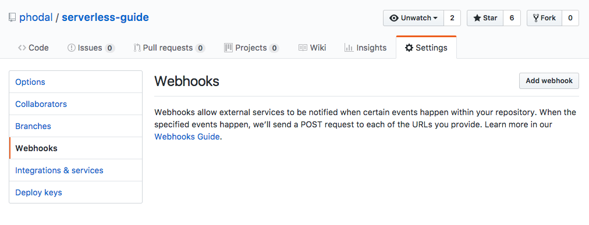
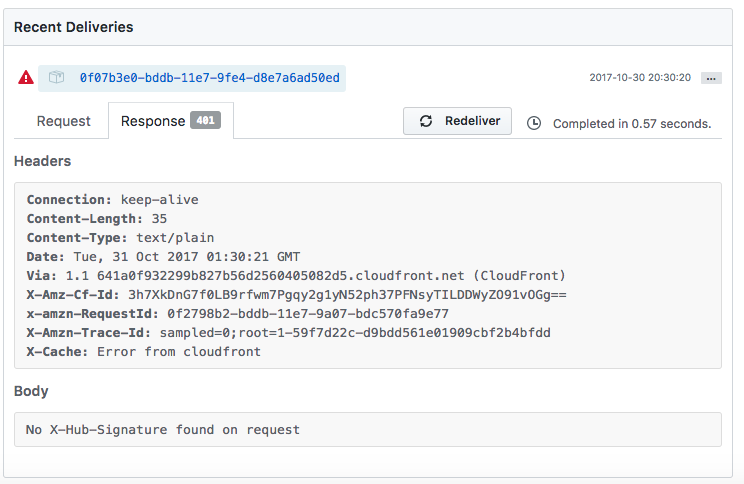
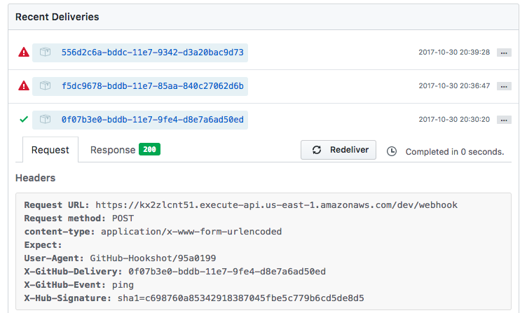

Serverless 应用开发指南：GitHub Webhooks
===

> Webhook 允许您构建或设置在 GitHub.com 上订阅某些事件的 GitHub 应用程序。当触发这些事件之一时，我们将向 webhook 配置的 URL 发送 HTTP POST 有效内容。

比如说，当我们 PUSH 了代码，我们想触发我们的持续集成。

安装：

```
serverless install -u https://github.com/serverless/examples/tree/master/aws-node-github-webhook-listener -n github-webhook
```

项目：

```
https://github.com/phodal/serverless-guide/settings/hooks
```

替换 serverless.yml 文件中的``REPLACE-WITH-YOUR-SECRET-HERE``:

```
provider:
  name: aws
  runtime: nodejs4.3
  environment:
    GITHUB_WEBHOOK_SECRET: fsalfkjaldfjalfjalf
```

然后执行部署：

```
serverless deploy
```

```
.................................
Serverless: Stack update finished...
Serverless: Invoke aws:info
Service Information
service: github-webhook
stage: dev
region: us-east-1
stack: github-webhook-dev
api keys:
  None
endpoints:
  POST - https://kx2zlcnt51.execute-api.us-east-1.amazonaws.com/dev/webhook
functions:
  githubWebhookListener: github-webhook-dev-githubWebhookListener
Serverless: Invoke aws:deploy:finalize
```

再将密钥和 API 地址填入 GitHub 后台里。




可以勾上 push 等事件用来测试。

```
serverless logs -f githubWebhookListener -t
```

代码
---

**serverless.yml**

配置：

```
service: github-webhook

provider:
  name: aws
  runtime: nodejs4.3
  environment:
    GITHUB_WEBHOOK_SECRET: blablabla

functions:
  githubWebhookListener:
    handler: handler.githubWebhookListener
    events:
      - http:
          path: webhook
          method: post
          cors: true
```

**handler.js**

```
const crypto = require('crypto');

function signRequestBody(key, body) {
  return `sha1=${crypto.createHmac('sha1', key).update(body, 'utf-8').digest('hex')}`;
}

module.exports.githubWebhookListener = (event, context, callback) => {
  var errMsg; // eslint-disable-line
  const token = process.env.GITHUB_WEBHOOK_SECRET;
  const headers = event.headers;
  const sig = headers['X-Hub-Signature'];
  const githubEvent = headers['X-GitHub-Event'];
  const id = headers['X-GitHub-Delivery'];
  const calculatedSig = signRequestBody(token, event.body);

  if (typeof token !== 'string') {
    errMsg = 'Must provide a \'GITHUB_WEBHOOK_SECRET\' env variable';
    return callback(null, {
      statusCode: 401,
      headers: { 'Content-Type': 'text/plain' },
      body: errMsg,
    });
  }

  if (!sig) {
    errMsg = 'No X-Hub-Signature found on request';
    return callback(null, {
      statusCode: 401,
      headers: { 'Content-Type': 'text/plain' },
      body: errMsg,
    });
  }

  if (!githubEvent) {
    errMsg = 'No X-Github-Event found on request';
    return callback(null, {
      statusCode: 422,
      headers: { 'Content-Type': 'text/plain' },
      body: errMsg,
    });
  }

  if (!id) {
    errMsg = 'No X-Github-Delivery found on request';
    return callback(null, {
      statusCode: 401,
      headers: { 'Content-Type': 'text/plain' },
      body: errMsg,
    });
  }

  if (sig !== calculatedSig) {
    errMsg = 'X-Hub-Signature incorrect. Github webhook token doesn\'t match';
    return callback(null, {
      statusCode: 401,
      headers: { 'Content-Type': 'text/plain' },
      body: errMsg,
    });
  }

  /* eslint-disable */
  console.log('---------------------------------');
  console.log(`Github-Event: "${githubEvent}" with action: "${event.body.action}"`);
  console.log('---------------------------------');
  console.log('Payload', event.body);
  /* eslint-enable */

  // Do custom stuff here with github event data
  // For more on events see https://developer.github.com/v3/activity/events/types/

  const response = {
    statusCode: 200,
    body: JSON.stringify({
      input: event,
    }),
  };

  return callback(null, response);
};
```


原理
---

如官方提供的工作原理是：


```
┌───────────────┐               ┌───────────┐
│               │               │           │
│  Github repo  │               │   Github  │
│   activity    │────Trigger───▶│  Webhook  │
│               │               │           │
└───────────────┘               └───────────┘
                                      │
                     ┌────POST────────┘
                     │
          ┌──────────▼─────────┐
          │ ┌────────────────┐ │
          │ │  API Gateway   │ │
          │ │    Endpoint    │ │
          │ └────────────────┘ │
          └─────────┬──────────┘
                    │
                    │
         ┌──────────▼──────────┐
         │ ┌────────────────┐  │
         │ │                │  │
         │ │     Lambda     │  │
         │ │    Function    │  │
         │ │                │  │
         │ └────────────────┘  │
         └─────────────────────┘
                    │
                    │
                    ▼
         ┌────────────────────┐
         │                    │
         │      Do stuff      │
         │                    │
         └────────────────────┘
```


测试
---

起先我测试的时候，没有配置好密钥，出现了一个 401 错误：



重新发了请求之后：


