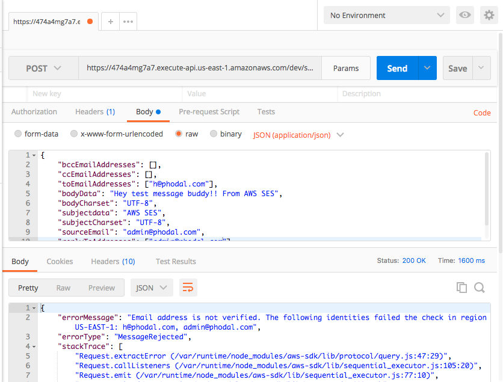

```
Serverless: Packaging service...
Serverless: Excluding development dependencies...
Serverless: Invoke aws:package:finalize
Serverless: Invoke aws:common:moveArtifactsToPackage
Serverless: Invoke aws:common:validate
Serverless: Invoke aws:deploy:deploy
Serverless: Creating Stack...
Serverless: Checking Stack create progress...
CloudFormation - CREATE_IN_PROGRESS - AWS::CloudFormation::Stack - aws-ses-dev
CloudFormation - CREATE_IN_PROGRESS - AWS::S3::Bucket - ServerlessDeploymentBucket
CloudFormation - CREATE_IN_PROGRESS - AWS::S3::Bucket - ServerlessDeploymentBucket
CloudFormation - CREATE_COMPLETE - AWS::S3::Bucket - ServerlessDeploymentBucket
CloudFormation - CREATE_COMPLETE - AWS::CloudFormation::Stack - aws-ses-dev
Serverless: Stack create finished...
Serverless: Uploading CloudFormation file to S3...
Serverless: Uploading artifacts...
Serverless: Uploading service .zip file to S3 (342.07 KB)...
Serverless: Validating template...
Serverless: Updating Stack...
Serverless: Checking Stack update progress...
CloudFormation - UPDATE_IN_PROGRESS - AWS::CloudFormation::Stack - aws-ses-dev
CloudFormation - CREATE_IN_PROGRESS - AWS::Logs::LogGroup - SendMailLogGroup
CloudFormation - CREATE_IN_PROGRESS - AWS::ApiGateway::RestApi - ApiGatewayRestApi
CloudFormation - CREATE_IN_PROGRESS - AWS::IAM::Role - IamRoleLambdaExecution
CloudFormation - CREATE_IN_PROGRESS - AWS::Logs::LogGroup - SendMailLogGroup
CloudFormation - CREATE_IN_PROGRESS - AWS::ApiGateway::RestApi - ApiGatewayRestApi
CloudFormation - CREATE_IN_PROGRESS - AWS::IAM::Role - IamRoleLambdaExecution
CloudFormation - CREATE_COMPLETE - AWS::Logs::LogGroup - SendMailLogGroup
CloudFormation - CREATE_COMPLETE - AWS::ApiGateway::RestApi - ApiGatewayRestApi
CloudFormation - CREATE_IN_PROGRESS - AWS::ApiGateway::Resource - ApiGatewayResourceSendmail
CloudFormation - CREATE_IN_PROGRESS - AWS::ApiGateway::Resource - ApiGatewayResourceSendmail
CloudFormation - CREATE_COMPLETE - AWS::ApiGateway::Resource - ApiGatewayResourceSendmail
CloudFormation - CREATE_IN_PROGRESS - AWS::ApiGateway::Method - ApiGatewayMethodSendmailOptions
CloudFormation - CREATE_IN_PROGRESS - AWS::ApiGateway::Method - ApiGatewayMethodSendmailOptions
CloudFormation - CREATE_COMPLETE - AWS::ApiGateway::Method - ApiGatewayMethodSendmailOptions
CloudFormation - CREATE_COMPLETE - AWS::IAM::Role - IamRoleLambdaExecution
CloudFormation - CREATE_IN_PROGRESS - AWS::Lambda::Function - SendMailLambdaFunction
CloudFormation - CREATE_IN_PROGRESS - AWS::Lambda::Function - SendMailLambdaFunction
CloudFormation - CREATE_COMPLETE - AWS::Lambda::Function - SendMailLambdaFunction
CloudFormation - CREATE_IN_PROGRESS - AWS::ApiGateway::Method - ApiGatewayMethodSendmailPost
CloudFormation - CREATE_IN_PROGRESS - AWS::Lambda::Permission - SendMailLambdaPermissionApiGateway
CloudFormation - CREATE_IN_PROGRESS - AWS::ApiGateway::Method - ApiGatewayMethodSendmailPost
CloudFormation - CREATE_IN_PROGRESS - AWS::Lambda::Version - SendMailLambdaVersionL8TaA7BYiH8VrqoP1h3UxwkMCv4YzAoqr3eCeL5g4E
CloudFormation - CREATE_IN_PROGRESS - AWS::Lambda::Permission - SendMailLambdaPermissionApiGateway
CloudFormation - CREATE_IN_PROGRESS - AWS::Lambda::Version - SendMailLambdaVersionL8TaA7BYiH8VrqoP1h3UxwkMCv4YzAoqr3eCeL5g4E
CloudFormation - CREATE_COMPLETE - AWS::Lambda::Version - SendMailLambdaVersionL8TaA7BYiH8VrqoP1h3UxwkMCv4YzAoqr3eCeL5g4E
CloudFormation - CREATE_COMPLETE - AWS::ApiGateway::Method - ApiGatewayMethodSendmailPost
CloudFormation - CREATE_IN_PROGRESS - AWS::ApiGateway::Deployment - ApiGatewayDeployment1509695084499
CloudFormation - CREATE_IN_PROGRESS - AWS::ApiGateway::Deployment - ApiGatewayDeployment1509695084499
CloudFormation - CREATE_COMPLETE - AWS::ApiGateway::Deployment - ApiGatewayDeployment1509695084499
CloudFormation - CREATE_COMPLETE - AWS::Lambda::Permission - SendMailLambdaPermissionApiGateway
CloudFormation - UPDATE_COMPLETE_CLEANUP_IN_PROGRESS - AWS::CloudFormation::Stack - aws-ses-dev
CloudFormation - UPDATE_COMPLETE - AWS::CloudFormation::Stack - aws-ses-dev
Serverless: Stack update finished...
Serverless: Invoke aws:info
Service Information
service: aws-ses
stage: dev
region: us-east-1
stack: aws-ses-dev
api keys:
  None
endpoints:
  POST - https://474a4mg7a7.execute-api.us-east-1.amazonaws.com/dev/sendMail
functions:
  sendMail: aws-ses-dev-sendMail

Stack Outputs
SendMailLambdaFunctionQualifiedArn: arn:aws:lambda:us-east-1:706605665335:function:aws-ses-dev-sendMail:1
ServiceEndpoint: https://474a4mg7a7.execute-api.us-east-1.amazonaws.com/dev
ServerlessDeploymentBucketName: aws-ses-dev-serverlessdeploymentbucket-14jvptxerdtxi

Serverless: Invoke aws:deploy:finalize
```



```
{
    "errorMessage": "There were 3 validation errors:\n* MissingRequiredParameter: Missing required key 'Source' in params\n* MissingRequiredParameter: Missing required key 'Data' in params.Message.Body.Text\n* MissingRequiredParameter: Missing required key 'Data' in params.Message.Subject",
    "errorType": "MultipleValidationErrors",
    "stackTrace": [
        "* MissingRequiredParameter: Missing required key 'Source' in params",
        "* MissingRequiredParameter: Missing required key 'Data' in params.Message.Body.Text",
        "* MissingRequiredParameter: Missing required key 'Data' in params.Message.Subject",
        "ParamValidator.validate (/var/runtime/node_modules/aws-sdk/lib/param_validator.js:40:28)",
        "Request.VALIDATE_PARAMETERS (/var/runtime/node_modules/aws-sdk/lib/event_listeners.js:125:42)",
        "Request.callListeners (/var/runtime/node_modules/aws-sdk/lib/sequential_executor.js:105:20)",
        "callNextListener (/var/runtime/node_modules/aws-sdk/lib/sequential_executor.js:95:12)",
        "/var/runtime/node_modules/aws-sdk/lib/event_listeners.js:85:9",
        "finish (/var/runtime/node_modules/aws-sdk/lib/config.js:315:7)",
        "/var/runtime/node_modules/aws-sdk/lib/config.js:333:9",
        "Credentials.get (/var/runtime/node_modules/aws-sdk/lib/credentials.js:126:7)",
        "getAsyncCredentials (/var/runtime/node_modules/aws-sdk/lib/config.js:327:24)",
        "Config.getCredentials (/var/runtime/node_modules/aws-sdk/lib/config.js:347:9)"
    ]
}
```

登录 SNS，验证一个邮箱。


